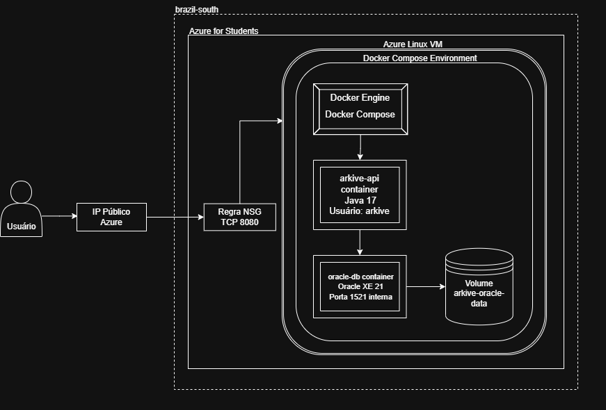

# Arkive API — DevOps Tools & Cloud Computing

## Descrição do Projeto

O **Arkive** é uma API REST desenvolvida em Java 17 com Spring Boot para gerenciamento de dados veterinários, incluindo responsáveis, animais, clínicas, veterinários, consultas, doenças, prescrições, protocolos preventivos e alertas.

Este projeto foi utilizado na entrega da disciplina DevOps Tools & Cloud Computing, com foco na conteinerização em nuvem da solução Java Advanced.

A aplicação é executada em uma Máquina Virtual Linux na Azure, utilizando Docker Compose para subir a API Java e o banco de dados Oracle XE em containers.

---

## Integrantes

| RM | Nome |
|---|---|
| RM561408 | Gustavo Crevelari Monteiro Porto |
| RM561996 | Lucca de Araujo Gomes |
| RM561671 | Rafaela Ferreira Santos |
| RM566224 | Victor Sabelli Rocha Batista |

---

## Benefícios para o Negócio

O Arkive oferece uma base centralizada para organização e rastreabilidade de informações relacionadas à saúde animal, permitindo que dados de responsáveis, animais, clínicas, consultas e eventos clínicos sejam organizados de forma estruturada.

Além dos benefícios funcionais da aplicação, a conteinerização da solução traz ganhos importantes para implantação, manutenção e evolução do sistema. Ao executar a API Java e o banco Oracle em containers, o ambiente se torna mais previsível, reproduzível e fácil de instalar em diferentes máquinas ou servidores em nuvem.

Principais benefícios:

- Centralização de dados veterinários;
- Organização de responsáveis, animais, clínicas e consultas;
- Histórico estruturado para acompanhamento da jornada animal;
- Base preparada para futuras análises, relatórios e integrações;
- Ambiente padronizado com Docker, reduzindo problemas de configuração entre máquinas diferentes;
- Implantação mais simples em nuvem, utilizando Docker Compose para subir API e banco com um único comando;
- Maior previsibilidade entre ambiente local e ambiente em cloud;
- Facilidade para recriar o ambiente em caso de falha, migração ou nova instalação;
- Separação clara entre aplicação e banco de dados, utilizando containers independentes;
- Persistência de dados utilizando banco Oracle containerizado com volume nomeado;
- Melhor base para evolução futura da solução, incluindo automação, CI/CD e escalabilidade.

---

## Arquitetura



A arquitetura utiliza uma VM Linux na Azure executando Docker Compose. A API Java Spring Boot é exposta pela porta `8080` através do IP público da VM, enquanto o banco Oracle XE roda em um container separado e persiste seus dados no volume nomeado `arkive-oracle-data`.

---

## Tecnologias Utilizadas

- Java 17
- Spring Boot
- Maven
- Oracle XE
- Docker
- Docker Compose
- Azure Virtual Machine
- Azure CLI
- Swagger/OpenAPI

---

## Arquivos de DevOps

Os principais arquivos da entrega DevOps estão disponíveis no repositório:

- [Script Azure CLI](scripts/azure-vm.sh)
- [Docker Compose YAML](docker-compose.yml)
- [Dockerfile](Dockerfile)
- [Imagem da Arquitetura](images/devops-fluxograma.png)

O script Azure CLI cria a infraestrutura em nuvem, abre a porta necessária para a API e instala Docker, Git, nano e demais ferramentas na VM.

O Docker Compose define a execução da API Java, do banco Oracle XE, da rede Docker e do volume nomeado para persistência dos dados.

---

## How To — Instalação da Solução

### 1. Criar a infraestrutura na Azure

```bash
./scripts/azure-vm.sh
```

### 2. Acessar a VM

```bash
ssh arkiveadm@<PUBLIC_IP>
```

### 3. Clonar o projeto na VM

```bash
git clone https://github.com/2TDSPO-1-2/devops-tools-cloud-computing.git
cd devops-tools-cloud-computing
```

### 4. Subir a aplicação e o banco com Docker

```bash
docker compose up -d --build
```

### 5. Acessar a aplicação

Swagger:

```text
http://<PUBLIC_IP>:8080/swagger-ui/index.html
```

Health check:

```text
http://<PUBLIC_IP>:8080/api/health
```

---

## Rotas Principais

| Método | Rota | Descrição |
|---|---|---|
| GET | `/api/health` | Verifica se a API está ativa |
| GET | `/api/responsaveis` | Lista responsáveis |
| GET | `/api/responsaveis/{id}` | Busca responsável por ID |
| POST | `/api/responsaveis` | Cria responsável |
| PUT | `/api/responsaveis/{id}` | Atualiza responsável |
| DELETE | `/api/responsaveis/{id}` | Realiza exclusão lógica do responsável |
| GET | `/api/especies` | Lista espécies |
| POST | `/api/especies` | Cria espécie |
| GET | `/api/racas` | Lista raças |
| POST | `/api/racas` | Cria raça |

---

## Persistência de Dados

O banco utilizado é o Oracle XE containerizado.

A persistência é feita por meio de volume nomeado no Docker:

```text
arkive-oracle-data
```

Dessa forma, os dados permanecem armazenados mesmo após reinicialização dos containers.

---

## Execução em Nuvem

A solução foi preparada para execução em nuvem através de uma VM Linux na Azure.

A aplicação deve ser acessada pelo IP público da VM, na porta `8080`.

```text
http://<PUBLIC_IP>:8080
```

---

## Remoção dos Recursos Azure

Ao final da entrega, a VM e seus recursos devem ser removidos conforme exigido.

```bash
az group delete --name <RESOURCE_GROUP_NAME> --yes
```

---

## Links da Entrega

Repositório GitHub:

[Arkive API — DevOps Tools & Cloud Computing](https://github.com/2TDSPO-1-2/devops-tools-cloud-computing)

Vídeo no YouTube:

[Demonstração da Entrega — Arkive DevOps](https://www.youtube.com/watch?v=uEOBFWUaONs)

---


